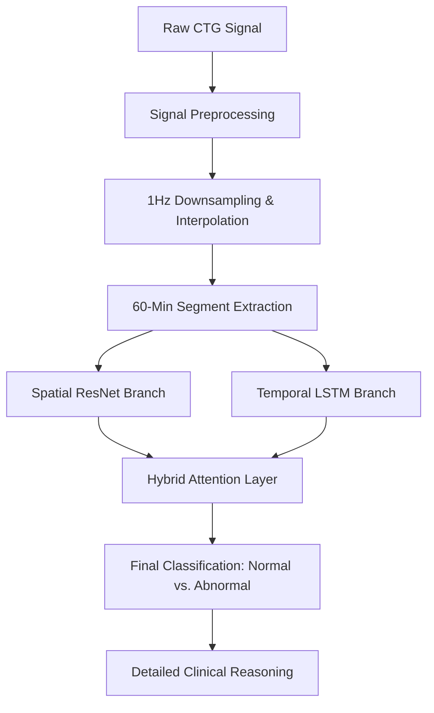

# AI-Assisted Cardiotocography (CTG) Analysis System

[🚀 Live Streamlit Application](https://ctg-clinical-classifier-9gzh2e7rkq5uzze7vvxsuz.streamlit.app/)

## Overview

This repository presents an advanced clinical decision support system for **Cardiotocography (CTG)** interpretation. The system integrates a dual-branch deep learning architecture with a robust clinical rule-based engine to provide objective analysis of fetal heart rate (FHR) and uterine contractions (UC).

The primary objective is to reduce inter-observer variability and enhance the diagnostic consistency of fetal well-being assessments during the antepartum and intrapartum periods.

## System Architecture

The core of the system is the **ResNet50 Hybrid Attention** model, which processes CTG signals through two specialized pathways:

### 1. Spatial Branch (ResNet50)
- Transforms 1D FHR signals into 2D morphological representations (spectrogram-like signal traces).
- Leverages the feature extraction power of **ResNet50** to detect visual patterns, mimicking expert visual interpretation.

### 2. Temporal Branch (LSTM/Attention)
- Processes raw time-series data to capture long-range dependencies.
- Analyzes 60-minute segments to identify trends and episodic events.

### 3. Integrated Decision Engine
- **Attention Mechanism**: Dynamically weighs clinical features (Decelerations, Accelerations, and Variability).
- **Rule-Based Fallback**: Combines deep learning predictions with a deterministic clinical logic engine for maximum clinical reliability.



## Key Clinical Metrics

The system extracts and reports the following vital parameters analyzed over a **60-minute window**:

| Metric | Key Feature | Clinical Significance & Thresholds |
| :--- | :--- | :--- |
| **Baseline FHR (LB)** | Basal Heart Rate | Normal range: 110–160 bpm. Identifies fetal tachycardia or bradycardia states. |
| **MSTV** | Mean Short-Term Variability | Primary indicator of the autonomic nervous system control. MSTV < 2.0 bpm is considered suspicious. |
| **Accelerations (AC)** | Transitory FHR Increases | Presence of periodic accelerations (>15 bpm for 15s) indicates a reactive, healthy fetus. |
| **Light Decelerations (DL)** | Mild Ephemeral Decreases | Temporary drops in FHR, typically associated with healthy physiological responses to labor. |
| **Severe Decelerations (DS)** | Deep FHR Drops | Decelerations dropping more than 45 bpm below baseline. Critical indicators of acute distress. |
| **Prolonged Decelerations (DP)** | Lengthy FHR Drops | Decelerations lasting >2 minutes. Significant risk factor for fetal hypoxia and acidemia. |
| **UC Rate** | Uterine Activity | Monitored as frequency per 10 minutes. Identifies tachysystole which can lead to fetal stress. |

## Reproducibility & Local Setup

To run the analysis system locally:

### 1. Requirements
Ensure you have Python 3.9+ installed.

### 2. Installation
```bash
# Clone the repository
git clone https://github.com/annapoorna-a-k/ctg-clinical-classifier
cd ctg-clinical-classifier/webapp

# Install dependencies
pip install -r requirements.txt
```

### 3. Running the App
```bash
streamlit run app.py
```

## Dataset
The model was trained and validated on balanced sets of clinical CTG recordings, utilizing standardized 1Hz downsampled signals following the DeepCTG research pipeline.

---
*Developed for M.Tech Final Semester Project — Cardiology & Deep Learning Research.*
